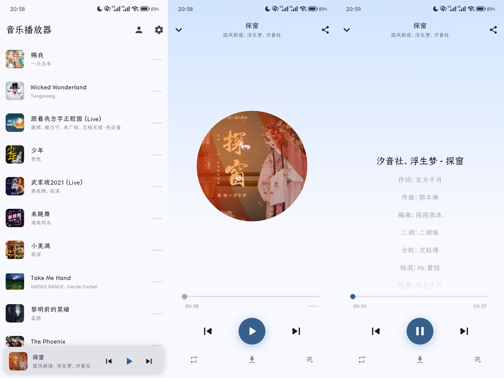

# HenkMusic

## 介绍

由于作者喜欢一个简洁的本地化的音乐播放器，但是又有大量歌单需要播放，所以HenkMusic诞生了。

HenkMusic 是一个基于 Flutter 的音乐播放器，支持本地音乐播放和网络音乐播放。

此软件对接了酷狗音乐的api，可以播放酷狗音乐歌单的歌曲，亦可下载。

## 项目截图

## 感谢

感谢项目 [MoekoeMusic](https://github.com/MoeKoeMusic/MoeKoeMusic) 提供的灵感

感谢项目 [KuGouMusicApi](https://github.com/MakcRe/KuGouMusicApi) 提供的api思路
